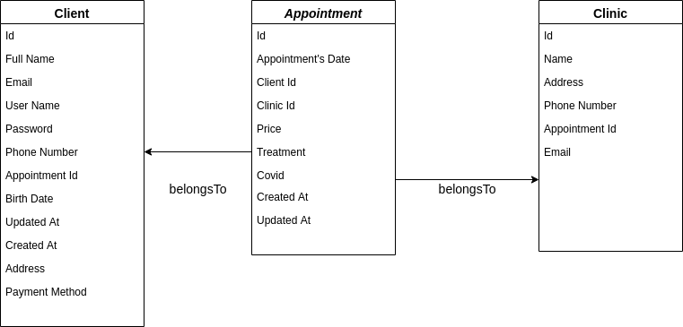

# Appointment App
### Backend with Sequelize & MySQL


### Table of Contents
1. [DB Diagram](#DB-Diagram)
2. [Technologies](#Technologies)
3. [Enviroment Vars](#Enviroment-Vars)
4. [Installation](#Installation)
5. [Authors](#Authors)

## DB-Diagram



## Technologies

| Tech | Description |
| ---- | ---- |
| Node.js | Node.js is a JavaScript runtime built on Chrome's V8 JavaScript engine. |
| Express | fast node.js network app framework |
| Sequelize | Sequelize is a promise-based Node.js ORM for Postgres, MySQL, MariaDB, SQLite and Microsoft SQL Server.|
| nodemon | fast node.js network app framework |
| jsonwebtoken | fast node.js network app framework for the implementation of JSON Web Tokens. |
| MySQL | MySQL Database Service is a fully managed database service to deploy cloud-native applications.|
| bcryptjs | Optimized bcrypt in JavaScript with zero dependencies|
| Docker Compose | Compose is a tool for defining and running multi-container Docker applications.|

## Enviroment-Vars

    * MYSQL_DATABASE
    * MYSQL_USER
    * MYSQL_PASSWORD
    * MYSQL_HOST
    * MYSQL_PORT


## Installation

The appointment app requires [Node.js](https://nodejs.org/) v^14.15.5 to run and [Docker](https://www.docker.com/) v^19.03.8

Install the dependencies and devDependencies.

```sh
npm i
```
Create and start all the services from the configuration in background.
```sh
docker-compose up -d
```
Remember to access the [localhost:8080](http://localhost:8080/) in your favourite browser

In order to build the data base in phpMyAdmin, access the source/ directory and run the following commands:

```sh
cd source/
```
```sh
sequelize db:create
```
```sh
sequelize db:migrate
```
```sh
sequelize db:seed:all
```
To run the server include the command in a terminal:
```sh
npm run start
```
##### Now you are up and running.

Click the below button in order to open Postman and press in the following link in order to open the [Postman Collection](https://documenter.getpostman.com/view/14551432/Tz5jfLYs) where you will find the different API routes of the app.


[](https://app.getpostman.com/run-collection/20f1441c147d9fec8c3b)

## Authors

    * Jesica Morocho Miguel
    * Diego Garcia Brisa

Special thanks to all the colleagues from @GeeksHubs Academy that gave us a hand.


